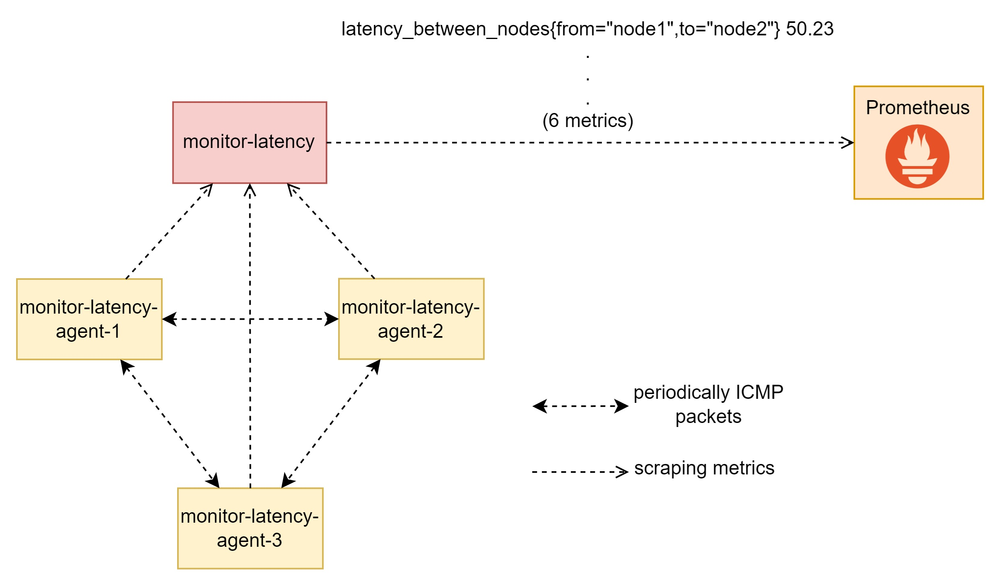

# Latency between Kubernetes Nodes Monitoring

## 1. Introduction

This is a monitoring system give us the ability of monitoring latency between Kubernetes Nodes. Metrics then is exported to Prometheus with metrics `latency_between_nodes`




## 2. Installation

### 2.1. Label Nodes

Kubernetes Nodes need to be labeled

```bash
chmod +x label.sh
./label.sh add # add labels
./label.sh delete # delete labels
```

### 2.2. Render agents' manifest

Agents are deployed in each nodes by 3 Pod manifest (instead of DaemonSet, I think the reason is our colaborator is so lazy). Pod's manifests are rendered automatically. Let's take a quick look in file [render.sh](render.sh)

```bash
...
#####CONFIG HERE#####
N_NODES=3 # number of node in Kubernetes Cluster, once again, our colaborator is so lazy
SLEEP=2 # agents will sent ICMP packet to each other every 2 seconds
#####################
...
```

After configuring two above constant, let's render Pods' manifests

```bash
chmod +x render.sh
./render.sh
```

A new file named [manifest/monlat-agents.yaml](manifest/monlat-agents.yaml) has been created!

### 2.3. Build Image

Rebuild image of `monlat` component if you need. Let's take a quick view in [src/build.sh](src/build.sh). Then, rebuild image if you need.

```bash
cd src
vi build.sh
...
#####CONFIG HERE#####
HUB="bonavadeur" # docker.io/$HUB/$NAME:$TAG
TAG="latest"
NAME="monlat"
#####################
...

chmod +x build.sh
./build.sh image # build from Golang code to Docker image
./build.sh push # push Docker image to Docker Hub
cd ..
```

### 2.4. Some other small changes

Specify image you use to run `monlat` and specified Nodes you want to deploy it in `Deployment` in file [manifest/monlat.yaml](manifest/monlat.yaml)

### 2.5. Install!

```bash
kubectl apply -f manifest/rbac.yaml
kubectl apply -f manifest/monlat-agents.yaml
kubectl apply -f manifest/monlat.yaml
```

Assume that Your Kubernetes run Prometheus before. Metrics are updated to prometheus immediately with metrics `latency_between_nodes`.

## 3. Contributeurs

My colaborators who write this system is [chungtd203338](https://github.com/chungtd203338). His original code is [monitor-delay-nodes-k8s](https://github.com/chungtd203338/monitor-delay-nodes-k8s)
