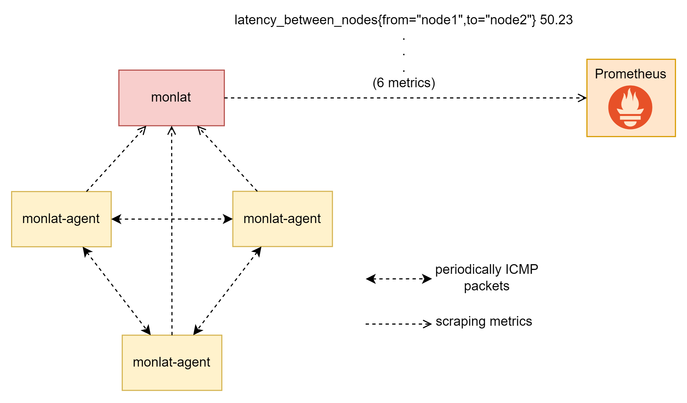

# Latency between Kubernetes Nodes Monitoring

## 1. Introduction

This is a monitoring system give us the ability of monitoring latency between Kubernetes Nodes. Metrics then is exported to Prometheus with metrics `latency_between_nodes`




## 2. Installation

Let's take a look in `manifest/monlat.yaml`, adjust the field `spec.template.spec.affinity` to choose the node which deploy monlat

```yaml
...
affinity:
   nodeAffinity:
      requiredDuringSchedulingIgnoredDuringExecution:
      nodeSelectorTerms:
      - matchExpressions:
         - key: kubernetes.io/hostname
            operator: In
            values:
            - node1
...
```

Install RBAC, `monlat-agent` and `monlat`

```bash
$ kubectl apply -f manifest/rbac.yaml
$ kubectl apply -f manifest/agents.yaml
$ kubectl apply -f manifest/monlat.yaml
```

## 3. Checking if system work correctly

View log of all **monlat-agent** Pods. It is expected to be looked like this:

```bash
latency_between_nodes{from="node2",to="node3"} 0.387
latency_between_nodes{from="node2",to="node1"} 0.463
latency_between_nodes{from="node2",to="node3"} 0.318
latency_between_nodes{from="node2",to="node1"} 0.440
```

Check if monlat is ready for scraping from Prometheus: view log of **monlat-...** Pod:

```bash
   ____    __
  / __/___/ /  ___
 / _// __/ _ \/ _ \
/___/\__/_//_/\___/ v4.12.0
High performance, minimalist Go web framework
https://echo.labstack.com
____________________________________O/_______
                                    O\
⇨ http server started on [::]:9090
```

Make a http request to get metrics from **monlat** service:

```bash
ubuntu@ubuntu:~/monlat$ curl monlat.default.svc.cluster.local:9090/metrics
latency_between_nodes{from="node1",to="node2"} 0.436
latency_between_nodes{from="node1",to="node3"} 0.314
latency_between_nodes{from="node2",to="node1"} 0.439
latency_between_nodes{from="node2",to="node3"} 0.379
latency_between_nodes{from="node3",to="node1"} 0.474
latency_between_nodes{from="node3",to="node2"} 0.323
```

### 4 Troubleshoting

If the system does not have any signs of stable operation as above, let's remove monlat and monlat-agent Pods.

If the problem still exists, please create an issue for this repo (Thanks).

## 5. Build your own version

### 5.1. Rebuild monlat-agent

Rebuild image of `monlat` component if you need. Let's take a quick view in [src/build.sh](src/build.sh). Then, rebuild image if you need.

```bash
cd agent
vi build.sh
...
#####CONFIG HERE#####
DOCKERHUB="bonavadeur"
TAG="latest"
NAME="monlat-agent" # docker.io/$HUB/$NAME:$TAG
#####################
...

chmod +x build.sh
./build.sh image # build from Bash script to Docker image
./build.sh push # push Docker image to Docker Hub
cd ..
```

### 5.2. Rebuild monlat

```bash
cd src
vi build.sh
...
#####CONFIG HERE#####
DOCKERHUB="bonavadeur"
TAG="latest"
NAME="monlat" # docker.io/$HUB/$NAME:$TAG
#####################
...

chmod +x build.sh
./build.sh image # build from Golang code to Docker image
./build.sh push # push Docker image to Docker Hub
cd ..
```

### 5.3. Some other small changes

Specify image you use to run `monlat` and specified Nodes you want to deploy it in `Deployment` in file [manifest/monlat.yaml](manifest/monlat.yaml) and [manifest/agents.yaml](manifest/agents.yaml)

Assume that Your Kubernetes run Prometheus before. Metrics are updated to prometheus immediately with metrics `latency_between_nodes`.

## 6. Contributeurs

Đào Hiệp - Bonavadeur - ボナちゃん  
The Future Internet Laboratory, Room E711 C7 Building, Hanoi University of Science and Technology, Vietnam.  
未来のインターネット研究室, C7 の E ７１１、ハノイ百科大学、ベトナム。  


